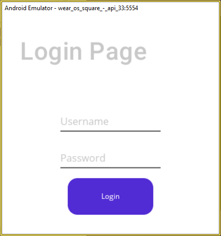
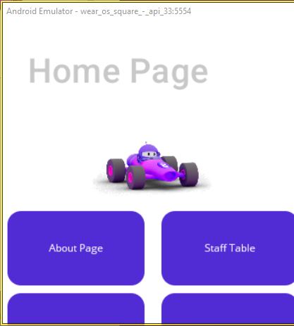
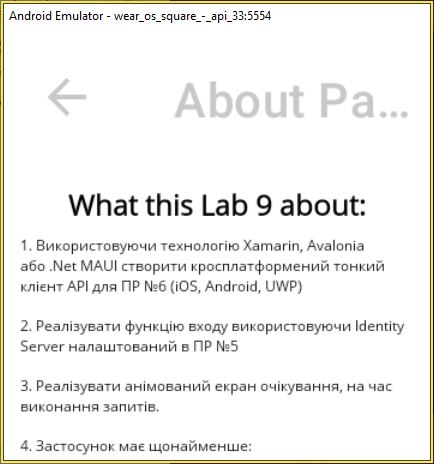
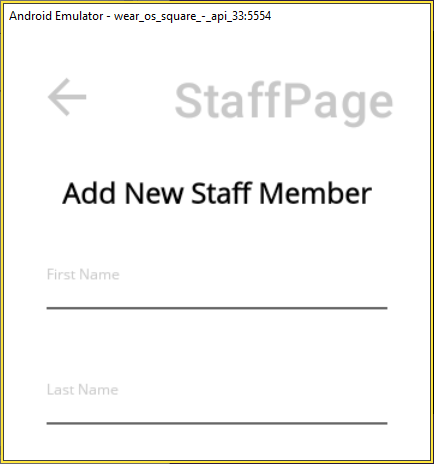

# Лабораторна робота 10

Оновлений застосунок, створений у межах лабораторної роботи №9, адаптовано для запуску та роботи на Wear OS. Для тестування використано емулятор пристрою Wear OS Square.

Декілька скріншотів-результатів:

