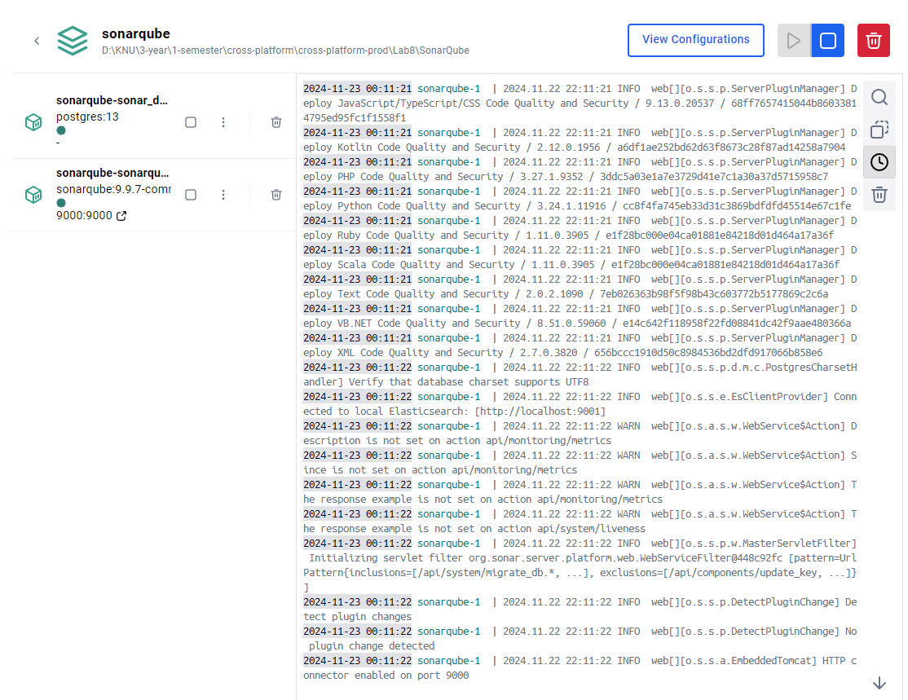

# Лабораторна робота 8 - Звіт

## Завдання 1. 
### Провести оцінку якості коду програмного забезпечення за допомогою **SonarQube**. Продемонструвати результати аналізу.

## Завдання 2
### Інтегрувати **OpenTelemetry** в застосунки ПР5 та ПР6. Запустити програму з **СУБД MsSQL** та зібрати метрики (К-ть об’єктів в поколіннях GC, розмір Heap, використані системні ресурси тощо). Все продемонструвати в **Grafana**, **ElasticSearch**, включаючи:
### - Розподілений трейс
### - Граф залежностей
### - Логи за допомогою:
###  - **Zipkin**, **Graphana**, **Prometheus**
###  - **ElasticSearch**

## Завдання 3
### Додати додаткові можливості в систему трейсингу:
### - a. Додаткові поля.
### - b. Додатковий SPAN для зімітованого тривалого процесу.

## Завдання 4
### Додати в **СУБД** достатню кількість записів (Seed) X > 10000 в будь-яку з центральних таблиць будь-яким найпростішим способом (наприклад, скориставшись згенерованим клієнтом, створити консольний застосунок для швидкого наповнення). Провести навантажувальне тестування **Asp.Net MVC** застосунку (відключити Okta на час тестування) за допомогою **jMeter + Influx + Grafana**. Оцінити поведінку програми для таких значень одночасних користувачів: 1, 5, 20, 50, 100, 300.

### a. Знайти:
### - i. **Error rate** для кожного.
### - ii. Функцію залежності між кількістю користувачів та часом на відповідь. Дослідити тип функції: лінійна, квадратична, логарифмічна тощо.

### b. За допомогою бекенду трасування **Zipkin + Graphana + Prometheus** знайти та продемонструвати найповільнішу частину застосунку. Запропонувати метод покращення (оптимізуємо що? як? А це можливо прискорити взагалі?).

Для подальшого покращення продуктивності Asp.Net MVC застосунку можна також налаштувати: 
-	кешування даних на рівні контролера або додатку для зменшення кількості запитів до бази даних;
-	оптимізацію SQL-запитів через використання індексів та підготовлених запитів;
-	застосувати асинхронні методи у контролерах для покращення масштабованості;
-	впровадити пагінацію для API, що повертає великі набори даних, а також системи моніторингу і профілювання для своєчасного виявлення проблем у продуктивності.

## Завдання 5
### Провести тестування застосунку на безпечність, використовуючи **OWASP ZAP**. Продемонструвати звіт.

[Репорт можна переглянути в results/report_OWASP_ZAP.](https://github.com/vladashvch/cross-platform-labs/tree/master/Lab8/results/report_OWASP_ZAP)

## Завдання 6
### Всі скрипти, звіти та докер файли додати в репозиторій в окремий каталог.

[Усі результати можна переглянути в results.](https://github.com/vladashvch/cross-platform-labs/tree/master/Lab8/results)
